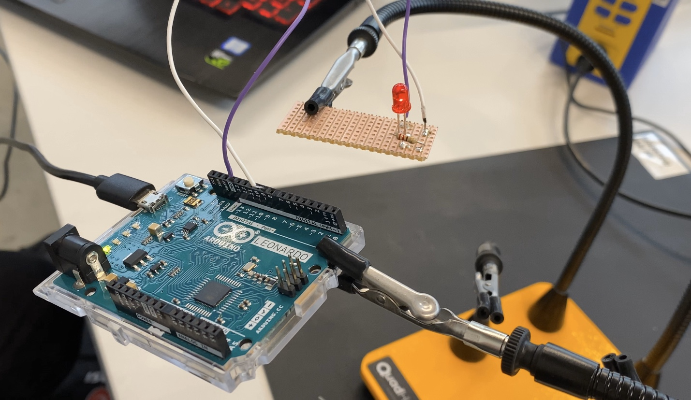
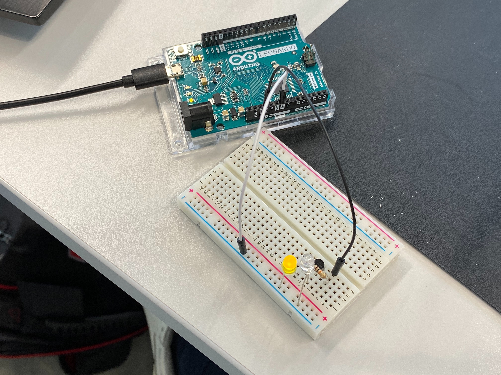

# Fading & Perf Boards

## Assignment

1. Playing with fades

- Build this circuit → https://www.arduino.cc/en/Tutorial/Fade
- Solder to perfboard

2. Hook up a potentiometer to and measure the changing voltage using a multimeter. No documentation required.
3. Make a dark detecting led

## Fading LED soldered to stripboard

I've soldered before, never on a strip board though. You need a steady hand but its lots of fun. It increases durability by loads. Desoldering is not a problem either.

Video documentation is here → https://youtu.be/mOpdjP65LPc

## Dark detecting LED

This acts as a photoresistor but looks like a normal LED. I'm not quite sure why you'd use one over the other? Its definately dangerously similar to an LED, and should'nt be put in the same box, as you'll dismiss it as a broken LED.

Video doc → https://youtu.be/BcIncVpee0I
