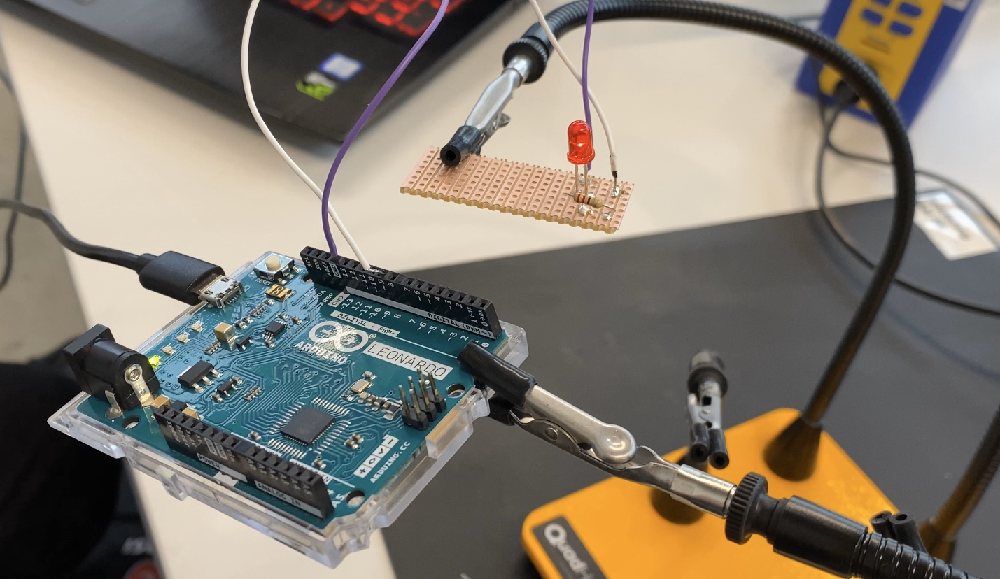
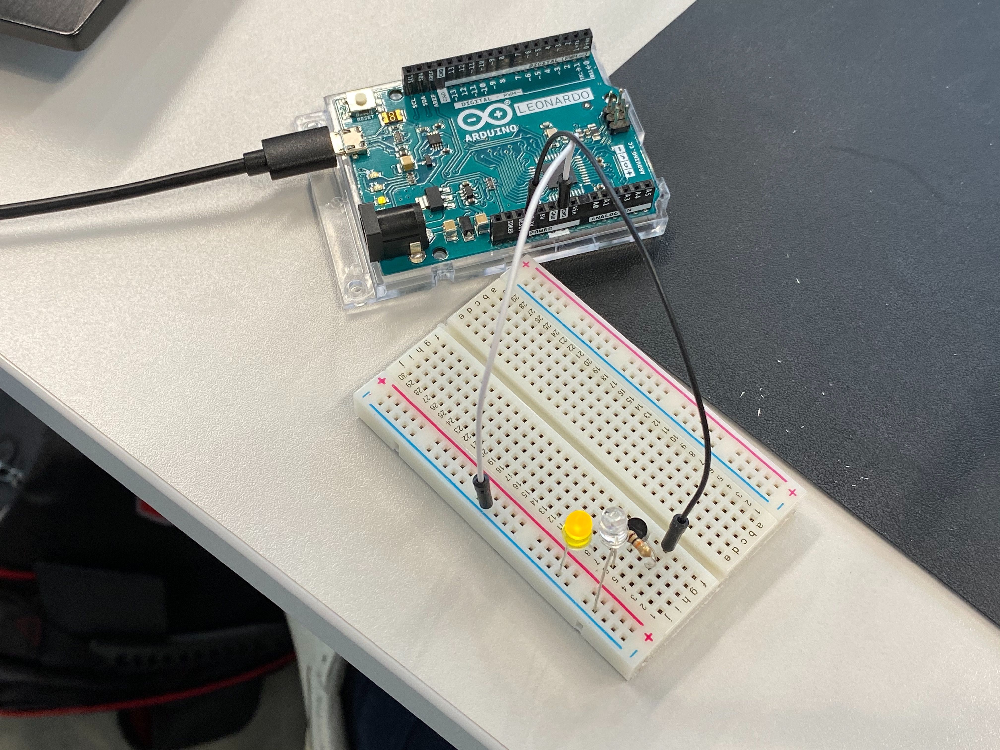

# Fading & Perf Boards

### Assignment

1. Playing with fades

- Build this circuit → https://www.arduino.cc/en/Tutorial/Fade
- Solder to perfboard

2. Hook up a potentiometer to and measure the changing voltage using a multimeter. No documentation required.
3. Make a dark detecting led

### Fading LED soldered to perfboard

Video doc → https://youtu.be/mOpdjP65LPc

### Dark detecting LED

Video doc → https://youtu.be/BcIncVpee0I
