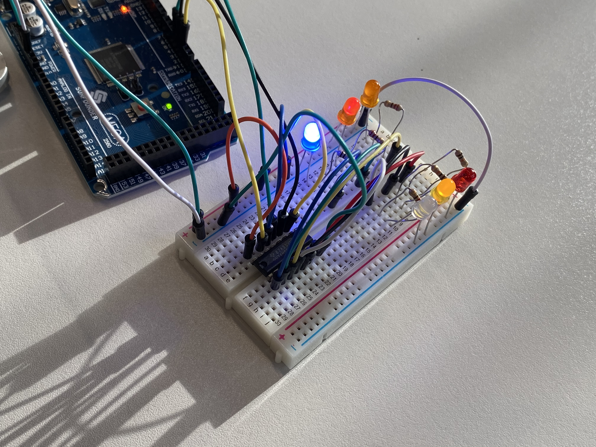

# Shift Registers and Multiplexing

### Assignment

Please follow this tutorial online and build both examples:  
https://learn.adafruit.com/adafruit-arduino-lesson-4-eight-leds/overview  
Submit a short video as always.

### Lab

Quite confusing this. Works well sometimes, and on other occasions it won't work at all and I can't figure out why. Getting the scematic right is quite challenging with this amount of pins. Had it live when I assembled it and it suddenly started reacting to the proximity of my finger. Late realized that my laptop was plugged into the mains—this is what caused it.

https://youtu.be/m7H3PAK1jWA  
https://youtu.be/IEZriN-9zxc

