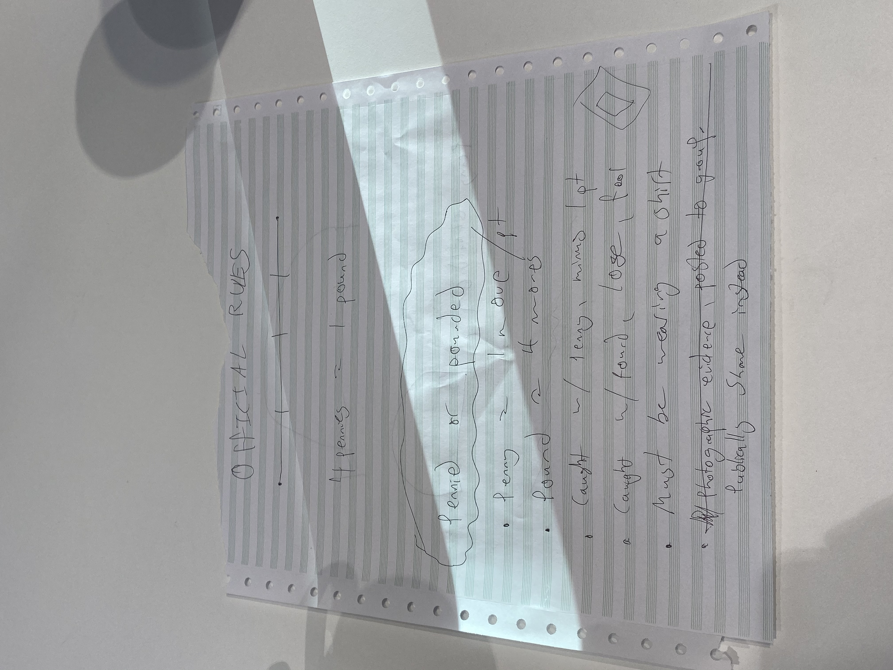

# Pennied or Pounded

Aleksi, Josh, Stuart, Mark, Moritz

We came up with a simple game in which one has to place a coin on a contestants shoulder, whilst not being detected.

- A penny and a pound may be used
- A player has to place four pennies to win (a penny accounts for one point)
- Placing a pound accounts for an immediate win
- Players have to wear shirts

Initially we argued that players would have to take a picture and post this in a special group. We agreed that the public humiliation of waering a penny/pound is sufficient to create tension, however.

## Game of Life

I followed Shiffman's tutorial on youtube: https://www.youtube.com/watch?v=FWSR_7kZuYg.

