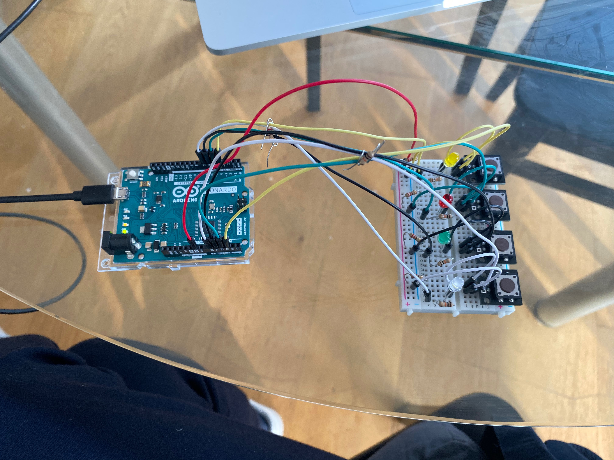

# Simple Simon Says Game

Brief: Get playful with buttons and LEDS. Make a simple timing game such as Simon Says with at least 3 level and a clear start and en. Have 3 buttons for interaction and make it so youpress the first botton to start the game. When the game is
over, all 3 LEDS should come on and stay in until the start button is pressed again. If you have an idea for a better game, give it a go. I'm open to you editing these briefs. This is graduate school, have fun.

Simon says example: https://create.arduino.cc/projecthub/Arduino_Scuola/a-simple-simon-says-game-25ba99

## Error Code

```c++
Arduino: 1.8.10 (Mac OS X), Board: “Arduino Leonardo”
Sketch uses 3956 bytes (13%) of program storage space. Maximum is 28672 bytes.
Global variables use 149 bytes (5%) of dynamic memory, leaving 2411 bytes for local variables. Maximum is 2560 bytes.
avrdude: ser_recv(): read error: Device not configured
avrdude: butterfly_recv(): programmer is not responding
avrdude: ser_drain(): read error: Device not configured
avrdude: ser_send(): write error: Device not configured
avrdude: ser_recv(): read error: Device not configured
avrdude: butterfly_recv(): programmer is not responding
avrdude: ser_send(): write error: Device not configured
avrdude: ser_recv(): read error: Device not configured
avrdude: butterfly_recv(): programmer is not responding
avrdude: ser_recv(): read error: Device not configured
avrdude: butterfly_recv(): programmer is not responding
avrdude: ser_send(): write error: Device not configured
avrdude: ser_recv(): read error: Device not configured
avrdude: butterfly_recv(): programmer is not responding
Found programmer: Id = “”; type =
   Software Version = .; Hardware Version = .
avrdude: ser_send(): write error: Device not configured
avrdude: ser_recv(): read error: Device not configured
avrdude: butterfly_recv(): programmer is not responding
avrdude: ser_send(): write error: Device not configured
avrdude: ser_recv(): read error: Device not configured
avrdude: butterfly_recv(): programmer is not responding
avrdude: error: buffered memory access not supported. Maybe it isn’t
a butterfly/AVR109 but a AVR910 device?
avrdude: initialization failed, rc=-1
        Double check connections and try again, or use -F to override
        this check.
avrdude: ser_send(): write error: Device not configured
avrdude: ser_recv(): read error: Device not configured
avrdude: butterfly_recv(): programmer is not responding
avrdude: error: programmer did not respond to command: leave prog mode
avrdude: ser_send(): write error: Device not configured
avrdude: ser_recv(): read error: Device not configured
avrdude: butterfly_recv(): programmer is not responding
avrdude: error: programmer did not respond to command: exit bootloader
avrdude: ser_close(): can’t reset attributes for device: Device not configured
the selected serial port avrdude: ser_close(): can’t reset attributes for device: Device not configured
does not exist or your board is not connected
This report would have more information with
“Show verbose output during compilation”
option enabled in File -> Preferences.
```

### Simon Says Layout:



### Logic
I'm trying to scribble down some code without actually being able to test anything

```java
int level = 0;

void setup() {
// declare analog inputs
   pinMode(A0, INPUT);
   pinMode(A1, INPUT);
   pinMode(A2, INPUT);
   pinMode(A3, INPUT);
   
// declare analog inputs
   pinMode(4, OUTPUT);
   pinMode(5, OUTPUT);
   pinMode(6, OUTPUT);
   pinMode(7, OUTPUT);
   
// set all outputs to low
   digitalWrite(4, LOW);
   digitalWrite(5, LOW);
   digitalWrite(6, LOW);
   digitalWrite(7, LOW);
}

if ((digitalRead(A0) == LOW) || (digitalRead(A1) == LOW) || (digitalRead(A2) == LOW) || (digitalRead(A3) == LOW) && level == 0) {
   level++;
   ShowLevelOne();
}

// Declare levels:
declare void ShowlevelOne() {
   digitalWrite(2, LOW);
   digitalWrite(3, LOW);
   digitalWrite(4, LOW);
   digitalWrite(5, LOW);
   delay(250);

   digitalWrite(2, HIGH);
   digitalWrite(3, HIGH);
   digitalWrite(4, HIGH);
   digitalWrite(5, HIGH);
   delay(500);

   digitalWrite(2, LOW);
   digitalWrite(3, LOW);
   digitalWrite(4, LOW);
   digitalWrite(5, LOW);
   delay(500);
}

declare void ShowlevelTwo() {
   ...
}

declare void ShowlevelThree() {
  ...
}

```
