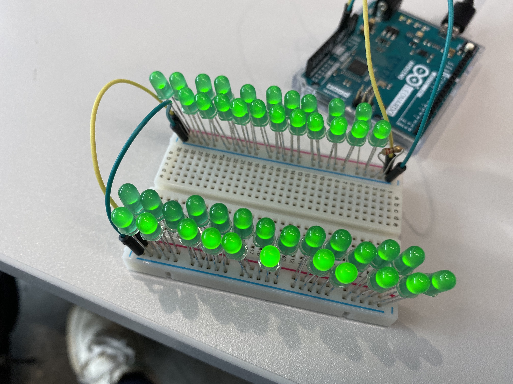
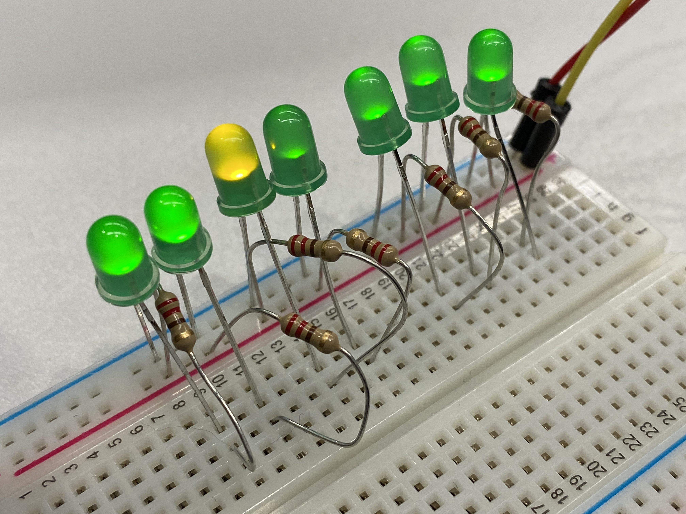
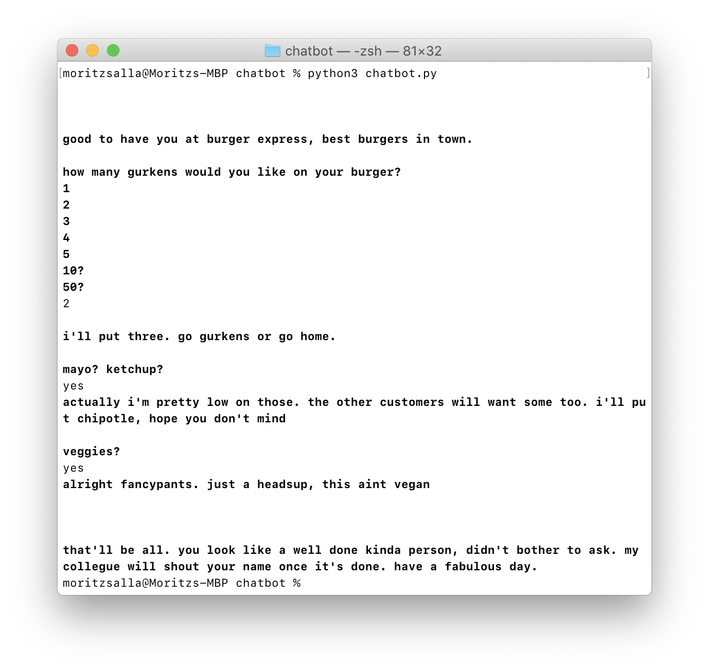
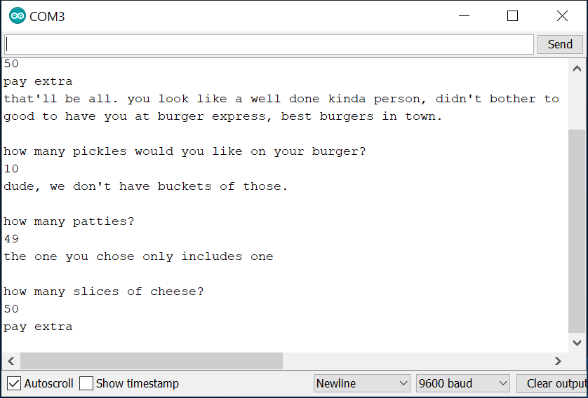
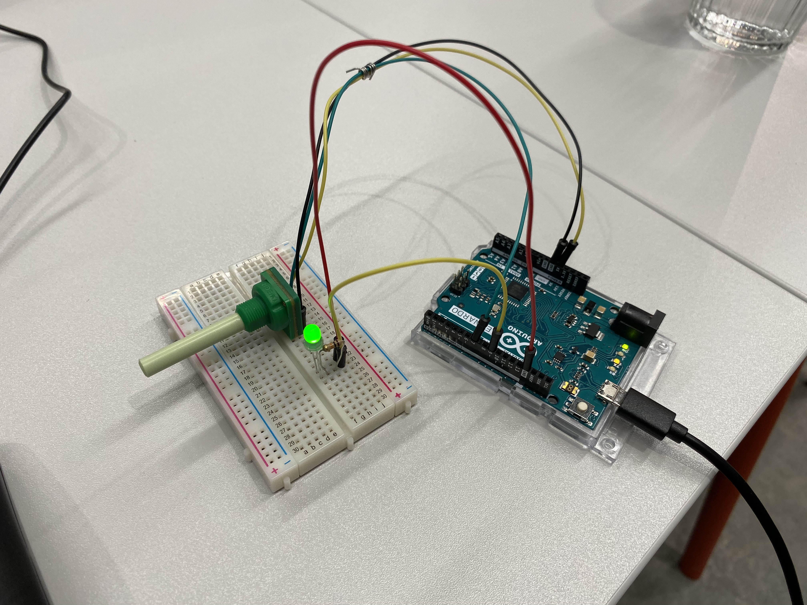
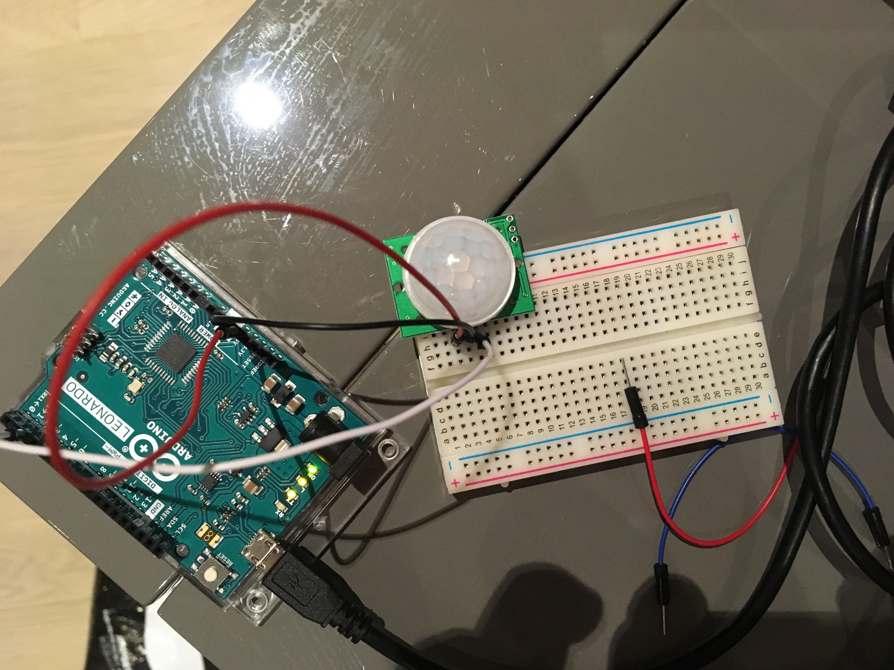
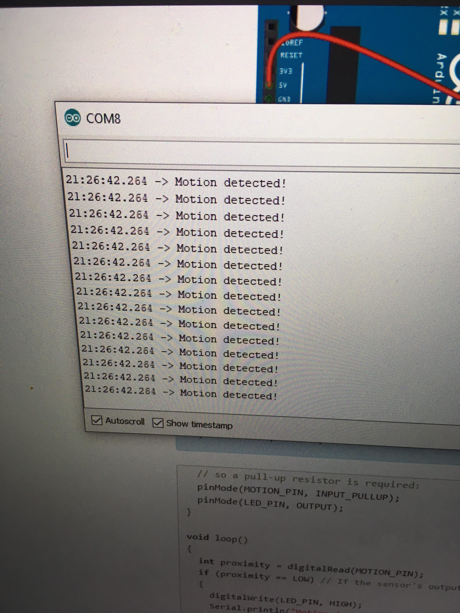

# Week 2 Practical

1. LEDs in serial & parallel
- How many leds can you hook up with a 220k resistor in serial before running out of voltage?
- How many leds can you hook up with a 220k resistor in parallel before running out of voltage?
2. Serial Data
- Using the hello sketch, play with the serial monitor( In the Arduino menu Tools>Serial Monitor) to tell a wee story based on player input. It can be around 3 lines long.
3. Potentiometers
- Hook up a knob and have it change the brightness of an LED
4. Light Dependent Resistors
- Hook up an LDR. Try making the LED change brightness depending on the light level.
5. Playing with Common Sensors
→ __Collab with Harry, we had the PIRS motion sensor__

## LEDs in series/parallel 

Practically more than I was able to test. How can this be so many? I am using the 220K transistor, as asked for. Ah, now I know, __I was using the 5V output and not a digital pin, which obviously has a lower voltage.__

### (Linear) RT = R1 + R2 + R3 ...

### (Parallel) R_total = 1/r1 + 1/r2 + 1/r3 ...

## Serial Data
My simple chatbot inspired by the miserable lady that serves food in the cantine.

I honestly have to say that the arduino serial input and loop function are really messing with me. I had already created the same chatbot in python (since my arduino IDE still won't work on my mac), which worked like a charm. The loop function will simply loop over all of my voids and I don't know how to make it stop at a given function until the player enters an input. I'll upload screenshots of both versions.

## Potentiometer

analogRead pot, analogWrite to pin using PWM. map(value, fromLow, fromHigh, toLow, toHigh) comes in handy!

→ https://youtu.be/KLnQmeqmp2c

## PIRS Motion Sensor

