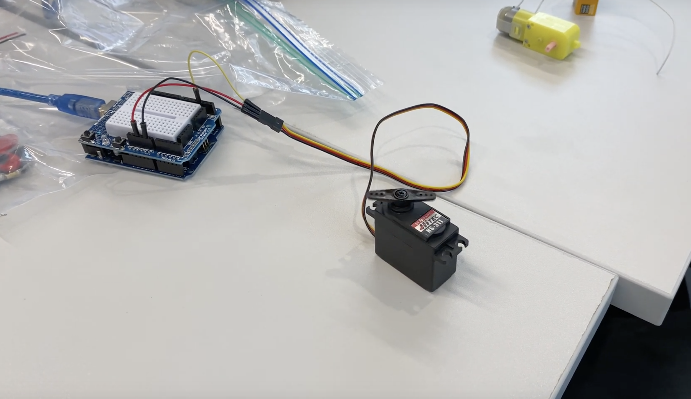
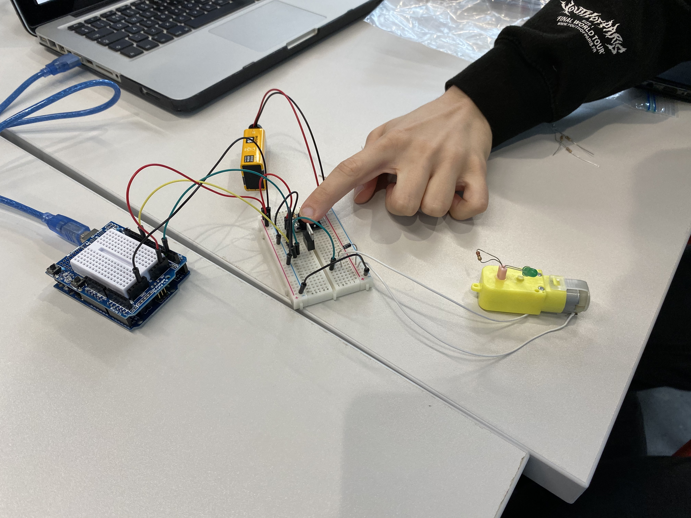
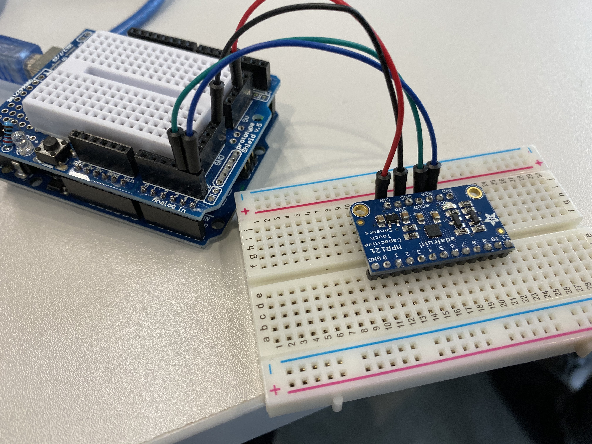
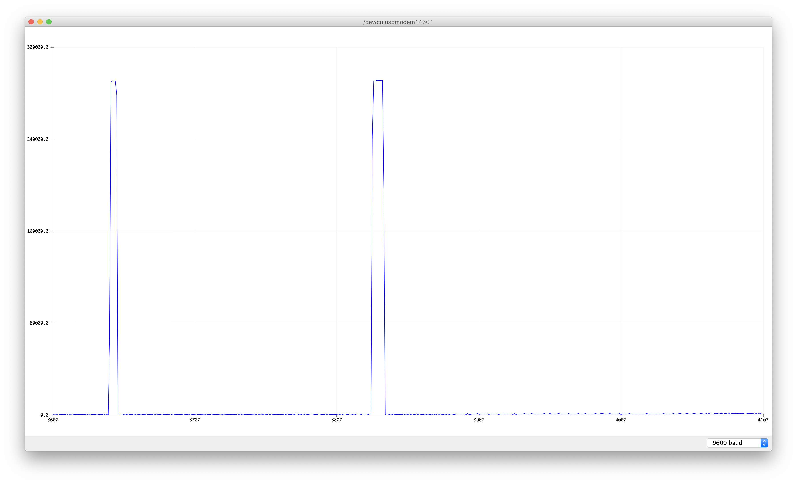
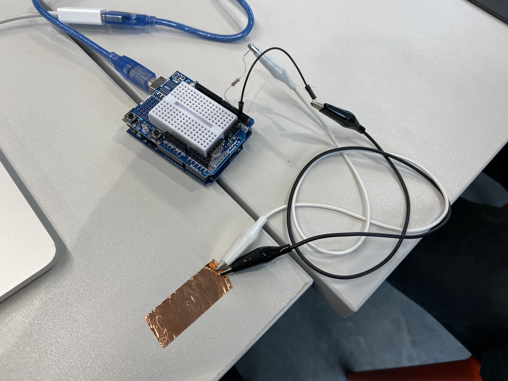
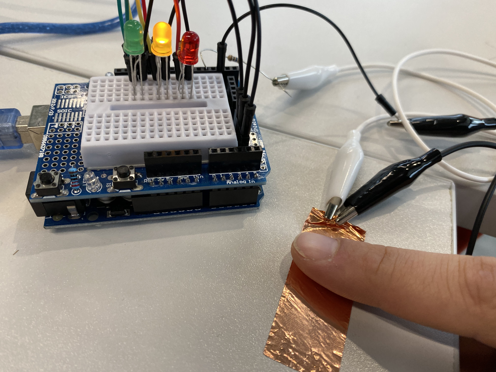

# Week 4 Practical

1. Project proposal
For next week make sure you fill out the final project proposal form

2. Hook up a servo.
Hook up a servo and make it move using pwm. Do this tutorial

3. Hook up a motor
Using the circuit from the Arduino project book, do project 9. Feel free to get creative with the pinwheel bit of you want.

4. Hook up an MPR121
Create a circuit you control with a touch sensor.
Do this tutorial

5. The Capsense library
Give a go with this tutorial What are some creative ideas you could do with this? Try one out and submit it as this lab.

### Project Proposal

I’m interested in how atmosphere is created through sound and light. Possibly because I'm the son of an opera singer and have a fascination for set design tucked away somewhere. I'm inspired by how light and sound interplay in Annie Tådne's "Boberg 1" and Felix Faire's "augmented acoustics" but feel the tabletop is quite an over-explored interface. Olafur Eliasson talks a lot about how work is created in the moment it is perceived by the viewer ("rainbow assembly" is a good example of this).

This made me wonder if light can be used as an interface, for example, to create tone, compositions and perhaps even dialog. Possibly by measuring for example brightness, color, source (artificial or sun), and duration. I'm not yet sure if the light source is to be static and there for the viewer to manipulate, or if it is free for the audience to bring in their own dynamic light sources. The output is a synthesizer that produces an array of different tones, which makes it possible to compose a melody by playing with the light in certain ways. Does a complex synthesizer count as multiple outputs? If not, I'd have to rethink and possibly add a visualization (if this doesn't interfere with the light sensors). This idea could develop into a game, an instrument, a performance or perhaps even a sort of design for therapy.

### Servo

→ https://www.youtube.com/watch?v=7iTaoesFQiI

### Motor

→ https://www.youtube.com/watch?v=NCE7Avfonng

### MPR121 Touch Sensor

→ https://www.youtube.com/watch?v=CDuVy3IS4fw

### Capsense Setup

Can sense the proximity of your finger to the copper sheet. Putting a sheet of paper in between finger and the copper will seemingly yield slightly more consistent results, almost like its smoothing it out.

→ https://www.youtube.com/watch?v=NMztw_KA2pQ

### Having fun with Capsense

This script visualizes how hard you press the copper sheet by toggling different LEDs at different input levels. If you hover your finger just where the clips touch the copper, the leds start to flicker rapidly.

→ https://www.youtube.com/watch?v=aLMEo92WnjQ

