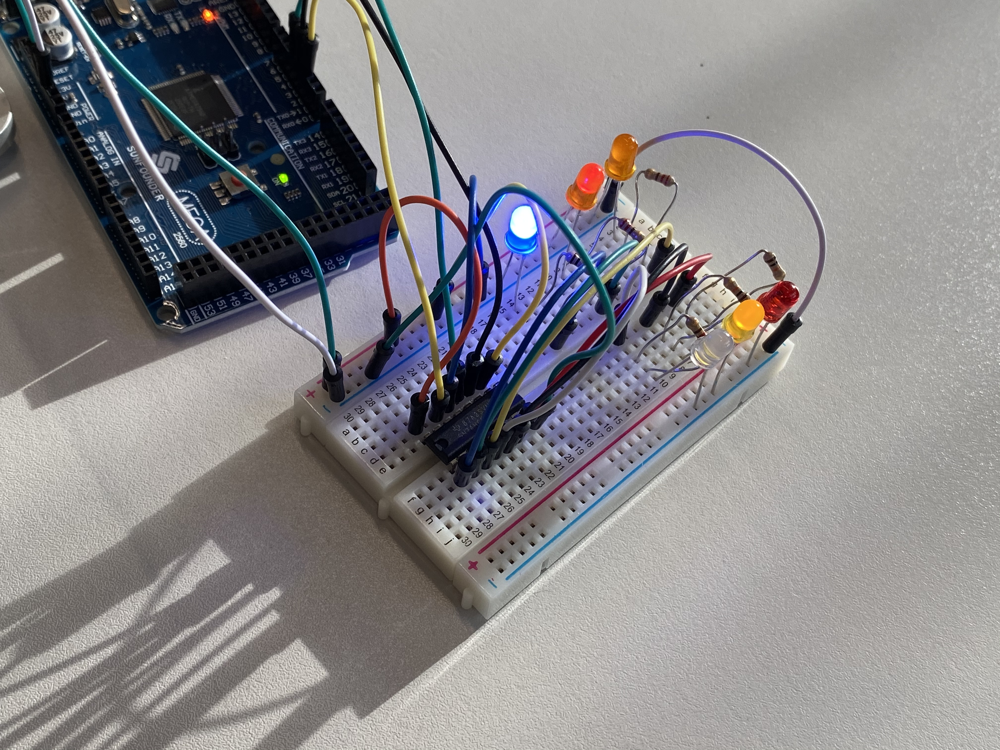

# Week 6 Practical

Please follow this tutorial online and build both examples: 
https://learn.adafruit.com/adafruit-arduino-lesson-4-eight-leds/overview 
Submit a short video as always.

### Shift Registers and Multiplexing

Quite confusing this. Works well sometimes, and on other occasions it won't work at all and I can't figure out why. Getting the scematic right is quite challenging with this amount of pins. 

https://youtu.be/m7H3PAK1jWA 
https://youtu.be/IEZriN-9zxc

