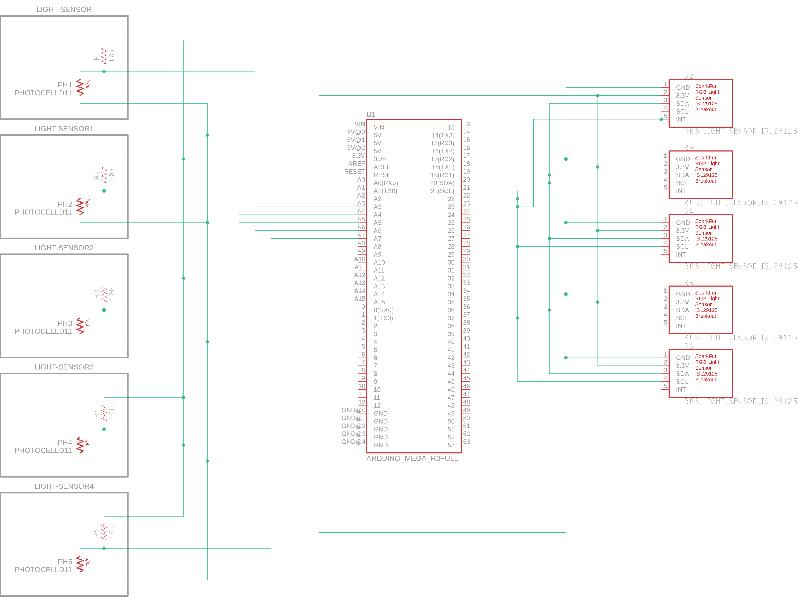

# Eagle

https://learn.sparkfun.com/tutorials/using-eagle-board-layout

My first eagle schematic, showing a sensor array of 5 photoresistors:

I have extended this by an array of ambient light sensors:

