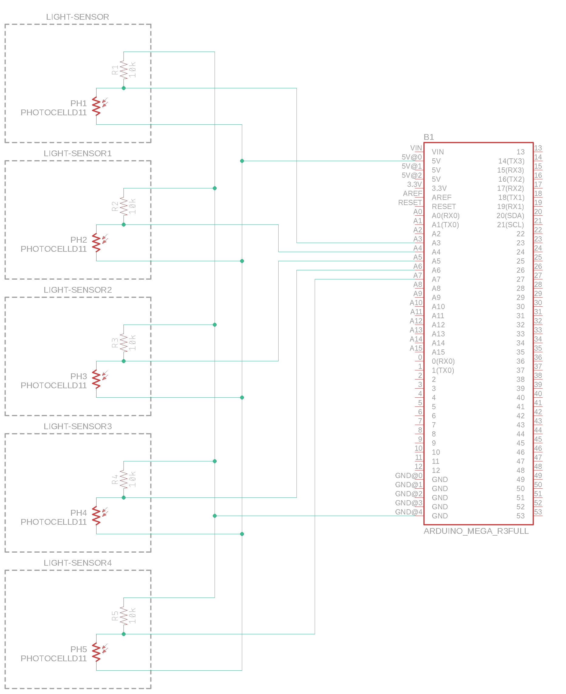

# Eagle

EAGLE is a scriptable electronic design automation application with schematic capture, printed circuit board layout, auto-router and computer-aided manufacturing features. EAGLE stands for Easily Applicable Graphical Layout Editor and is developed by CadSoft Computer GmbH.

Download components within the library section.

https://learn.sparkfun.com/tutorials/using-eagle-board-layout

### Schematics

My first eagle schematic, showing a sensor array of 5 photoresistors:

I have extended this by an array of ambient light sensors:

